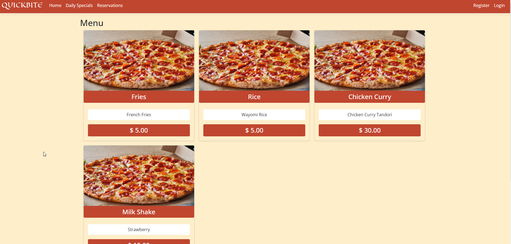
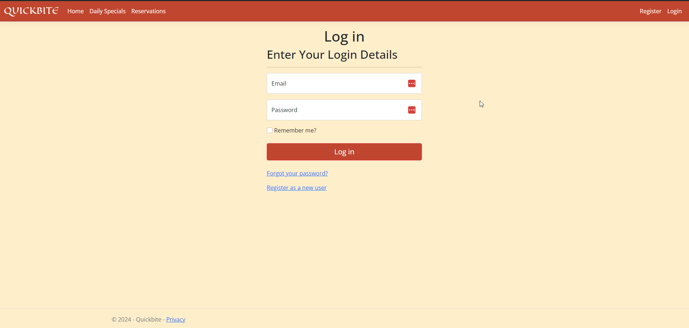
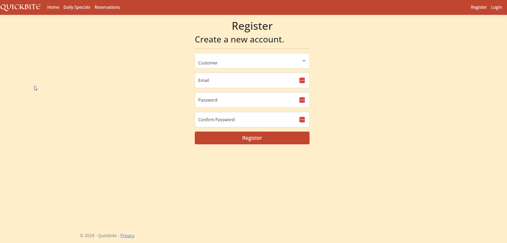
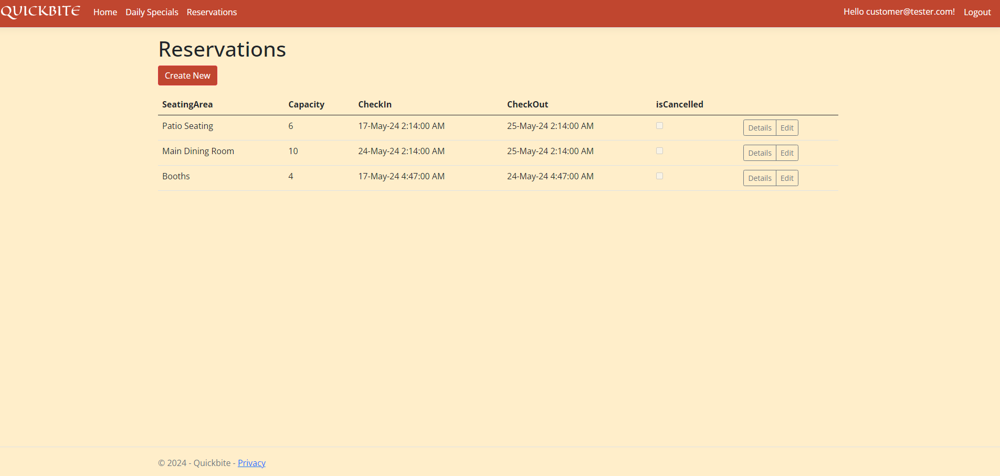
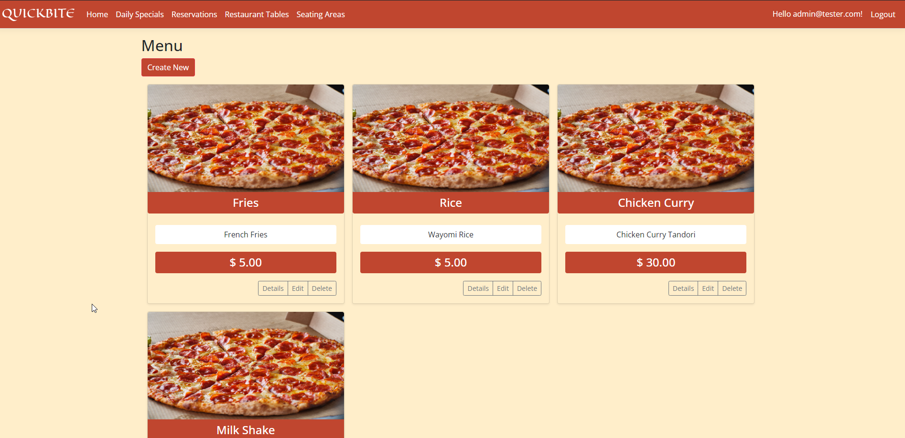
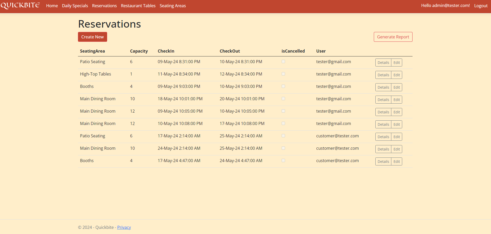
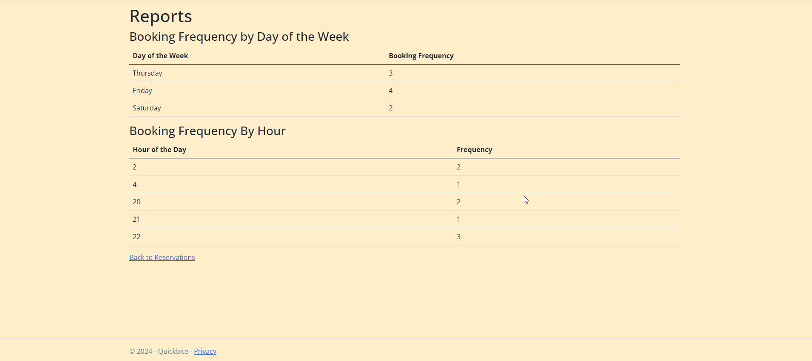
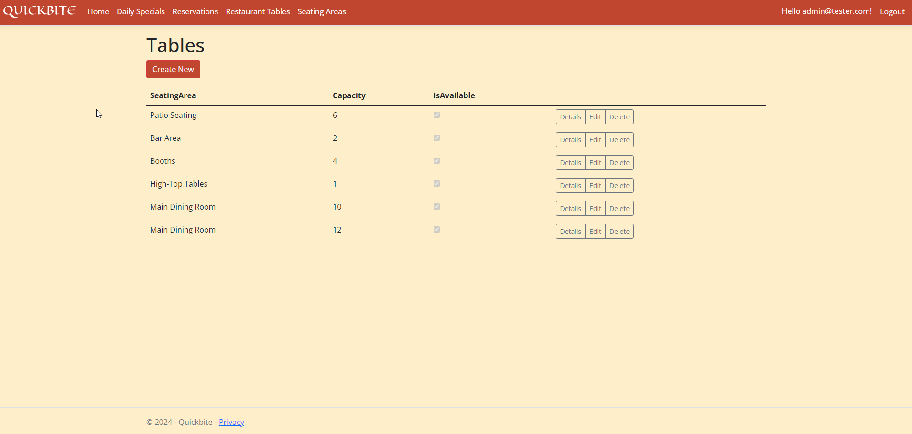
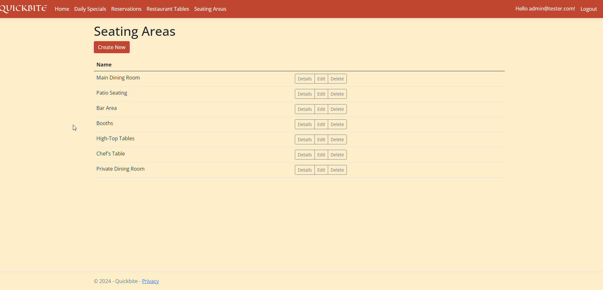

# Restaurant Reservation System

## Installation

- This project can be opened in Visual Studio 2022

- The other alternative is running it on a docker container in Linux using the attached Dockerfile.

## Usage

- This project can be used by either a customer or staff of the restaurant

## Customer Usage

- The customer will land on the home page shown above where they can view the menu
- Using the Navbar they can switch to different pages. They can see the Daily Specials offered by the Restaurant in the Daily Specials Page
- The Daily Specials page also shows the day which that menu is served.

### Reservations

- When an UnAuthorised Used Tries To Access the Reservations Page From the Navbar they will be redirected to the login page
- They can either login or create an account using the `Register as a new User` link.

- The Registration Page allows the selection of Roles which are either Staff or Customer. (The website is only for demonstration purposes)

- Once the Customer is Authenicated, they will be able to view any previous Reservations, Created new ones and Edit Exisiting ones.

## Staff Usage

- Once a staff member is authenticated, they will get access to more functionality than the Customers
- On the home page, they can create, edit and delete menus
- They also have more access to different pages like the Seating Areas and Restaurnat Tables.

- The Staff members can also view everyones Reservations for planning purposes
- They can also edit the reservations if need be

- For insights, the staff can generate a report which will give them the most frequent;y reserved hours and days of the week

- The staff have access to the Seating areas and Tables data where they can create, edit and delete them if need be.

**Tables Page**

**Seating Areas Page**

**ERD**
